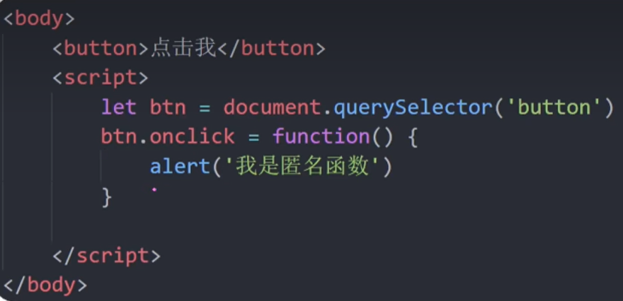

具名函数

```js
function add(x, y){
    return x+y;
}
```

函数表达式（匿名函数）

```js
let add = function(x, y){
	return x+y;
}
```

函数表达式是将匿名函数赋值给变量

具名函数和匿名函数的不同：

具名函数 的调用可以写到任何地方（比如函数声明前），匿名函数调用只能写到函数声明后

匿名函数使用场景：



